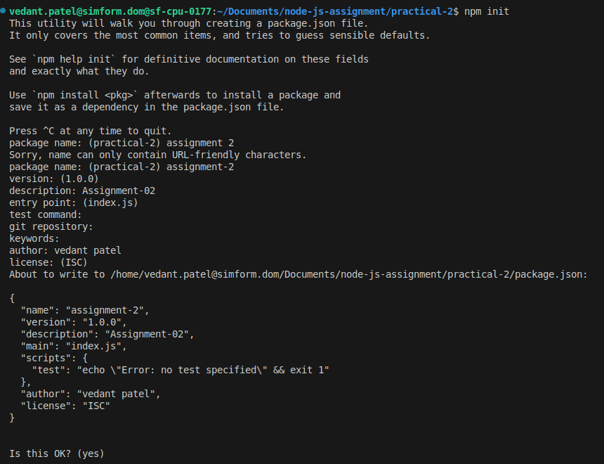

# Node.js Project: Exploring `npm init`

## Overview

This project involves creating a Node.js project and using the `npm init` command to generate a `package.json` file.

## Steps

1. Open a terminal and navigate to your project folder.
2. Run `npm init` and follow the prompts.
3. Alternatively, use `npm init -y` to generate a `package.json` file with default values.

## What is package.json?

The package.json file is a configuration file for Node.js projects. It contains information about the project, such as its name, version, dependencies, and scripts, allowing npm to manage packages and run commands efficiently.

## Example `package.json`

```json
{
  "name": "assignment-2",
  "version": "1.0.0",
  "description": "Assignment-02",
  "main": "index.js",
  "scripts": {
    "test": "echo \"Error: no test specified\" && exit 1"
  },
  "author": "Vedant Patel",
  "license": "ISC"
}
```

## Screenshot


