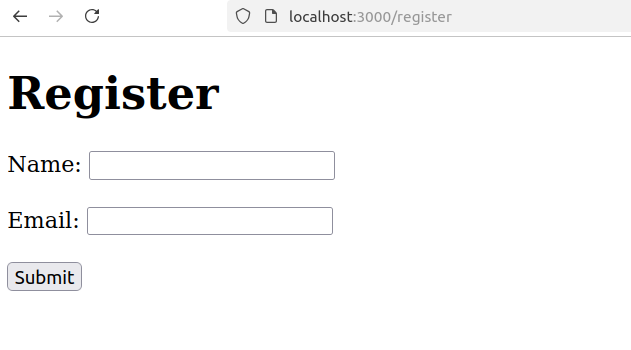
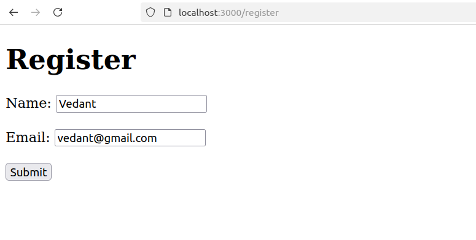
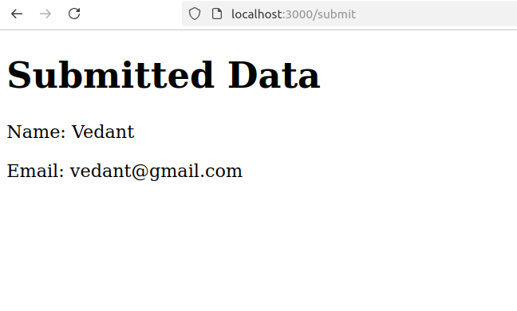

## Rendering engines assignment

Implemented a simple user form using EJS

### Tools used :

#### Rendering Engine : ejs

#### Backend : Node js

### Screenshots

#### Screenshot 1

#### Screenshot 2

#### Screenshot 3

