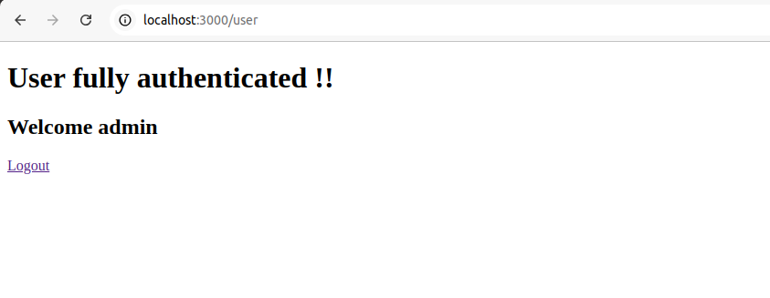

## Rendering engines assignment

Implemented a JWT authentication and authorization

### Tools used :

Rendering Engine : ejs
Backend : Node js
Authentication and Authorization: Jsonwebtoken
Security : custom CORS and HELMET functions to implementation

### Features :

- protected routes using JWT
- CORS and HELMET custom function
- Login/Logout functionality
- auto login feature in case of valid JWT

### Note

- For testing purposes, you can use the following credentials:
  - Username: `admin`
  - Password: `admin123`

### Screenshots

#### Screenshot 1

#### Screenshot 2

#### Screenshot 3

#### Screenshot 4

